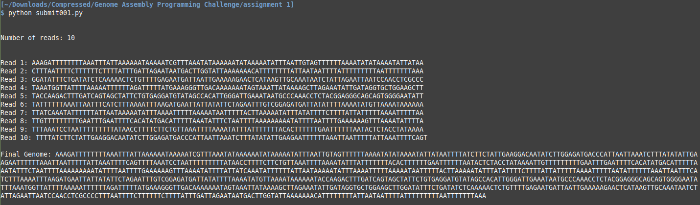
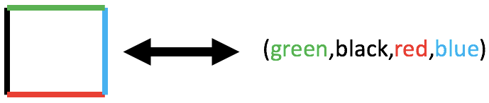
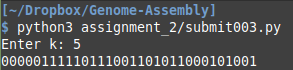
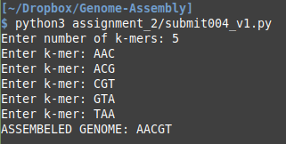
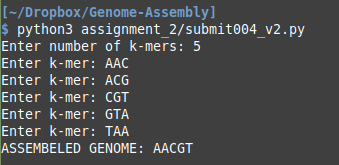
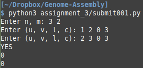
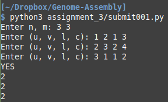
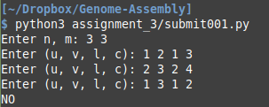
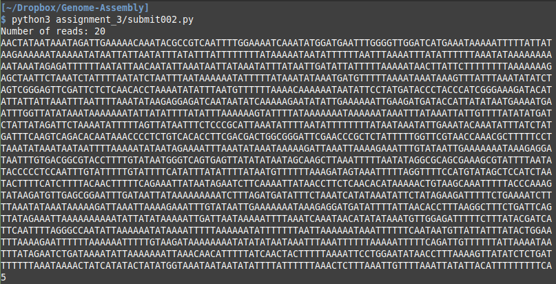

# Genome-Assembly

Assembled Phi-X174 genome using Overlap Graph, Kmer Composition and De-Bruijn Graph.

## phi X 174

The phi X 174 (or ΦX174) bacteriophage is a single-stranded DNA (ssDNA) virus and the first DNA-based genome to be sequenced. This work was completed by Fred Sanger and his team in 1977. In 1962, Walter Fiers and Robert Sinsheimer had already demonstrated the physical, covalently closed circularity of ΦX174 DNA. Nobel prize winner Arthur Kornberg used ΦX174 as a model to first prove that DNA synthesized in a test tube by purified enzymes could produce all the features of a natural virus, ushering in the age of synthetic biology. In 2003, it was reported by Craig Venter's group that the genome of ΦX174 was the first to be completely assembled in vitro from synthesized oligonucleotides. The ΦX174 virus particle has also been successfully assembled in vitro. Recently, it was shown how its highly overlapping genome can be fully decompressed and still remain functional.

## Problem Description:
#### Input: 
A collection of Strings called reads of the original genome. Each read is a sub-string of the original genome(Genome can be circular also).

#### Output:
A string S of minimum length that cantains all the strings(reads) given in the input as its sub-strings.

## Algorithms:
### 01. Overlap Graph Algorithm:
#### steps:
1. Construct an overlap graph. Two reads are joined by a directed edge of weight equal to the length of the maximum overlap of these two strings.

2. Then construct a Hamiltonian path in this graph in a greedy fashion.

3. Greedy Strategy : For each read select an outgoing edge of maximum weight. Why? Because the more the overlap between the reads shorter shorter will be the length of the combined string made of these reads.

4. Then read a string spelled by this path. i.e combine to form a super string.

5. Sometimes choosing the wrong first vertex may result in longer superstring. So you should generate random index probably 2-3 times and find minimum length super string.

6. Now in the last step since genome can be circular also so remove the overlap length between last and first read.

#### Note: 
This greedy algorithm does not work with every genome as it might not give optimal solution every time.

### 02. K-Mer Composition Algorithm:
#### What is K-mer Composition?
Given a String ACGTACTAT. Its 3-mer Composition is (ACG, CGT, GTA, TAC, ACT, CTA, TAT).

#### steps:
1. Read the k-mer composition of the graph.

2. Create the De-Bruijn graph from the k-mer composition.

3. Find an eulerian cycle in the graph.

4. Construct the genome from the found cycle.

### 03. Using De-Bruijn graph from Error-Prone Reads:
#### steps:
1. Read the reads of the genome from the input.

2. Create De-Bruijn Graph from the k-mers - which are formed by spitting the reads into all substrings of length k.

3. Remove the tips from the graph.

4. Remove the bubbles from the graph.(Do not remove bubbles of long lengths. Only remove bubbles of length less than k, which is the size of a k-mer. May also have to again remove tips after removing the bubbles.)

5. Find an Eulerian cycle in the graph.

6. Form the genome from the eulerian cycle found in the graph.

## HOW TO RUN CODE
#### All different assignments are there in folders to test simply go in the folder and run the codes with python3 interpreter
###### OR ######
### Problem Statements

----------------------
### Assignment 1 Qustion 1
**Task:** Given a list of error-free reads, perform the task of Genome Assembly and return the circular genome from which they came.

**Dataset:** Given a dataset of 33609 reads we are supposed to extract **_n_** random reads and perform given task.

> python3 assignment_1/submit001.py

  

----------------------
### Assignment 1 Qustion 2
**Task:** Given a list of error-prone reads, perform the task of Genome Assembly and return the circular genome from which they came.

**Dataset:** Given a dataset of 33609 reads we are supposed to extract **_n_** random reads and perform given task. Each read is 100 nucleotides long and contains a single sequencing error (i.e., one mismatch per read) in order to simulate the 1% error rate of Illumina sequencing machines. Note that you are not given the 100-mer composition of the genome (i.e., some 100-mers may be missing).

> python3 assignment_1/submit002.py

----------------------
### Assignment 2 Qustion 1
In this problem, we will consider a square puzzle consisting of n-by-n square pieces, where each square piece has a single color on each of its four edges. Given a set of n 2 square pieces, your task is to find a way to place them in an n-by-n grid such that all adjacent edges of square pieces are of the same color.

**Task:**
Let each square piece be defined by the four colors of its four edges, in the format (up,left,down,right). 
Below is an example of a square piece: 

Let a “valid placement” be defined as a placement of n 2 square pieces onto an n-by-n grid such that all “outer edges” (i.e., edges that border no other square pieces), and only these edges, are black, and for all edges that touch an edge in another square piece, the two touching edges are the same color. 
Below is an example of a “valid placement” on a 3-by-3 square grid: 
 

You will be given 25 square pieces in the format described above, and you will need to return a “valid placement” of them onto a 5-by-5 grid. 
To simplify the problem, we guarantee that all of the square pieces are given to you in the correct orientation (i.e., you will not need to rotate any of the pieces to have them fit in a “valid placement”). 
For example, the square (green,black,red,blue) and the similar square (black,red,blue,green) are not equivalent in this problem. 

**Dataset:** 
Each line of the input contains a single square piece, in the format described above: (up,left,down,right). 
You will be given 25 such pieces in total (so 25 lines of input). 
Note that all “outer edges” (i.e., edges that border no other square pieces on the puzzle) are black, and none of the “inner edges” (i.e., edges not on the outside border of the puzzle) are black. 

**Output Format:** 
Output a “valid placement" of the inputted pieces in a 5-by-5 grid. 
Specifically, your output should be exactly 5 lines long (representing the 5 rows of the grid), and on each line of your output, you should output 5 square pieces in the exact format described, (up,left,down,right), separated by semicolons. 
There should be no space characters at all in your output. 

> cd assignment_2

> g++ submit002.cpp

> ./a.out

----------------------
### Assignment 2 Qustion 2
**Task:** Given a directed graph, find an Eulerian cycle in the graph or report that none exists.

**Input format:** 
First line contain two integers n and m which are number of nodes and number of edges respectively. 
Followed by m lines. 
Each line has two integers u, v to represent there is an edge from u to v.

**Constraints:** 
1 ≤ n ≤ 104 
n ≤ m ≤ 105 
1 ≤ u, v ≤ n 

**Output Format:** 
If the graph has no Eulerian cycle, output 0. 
Otherwise output 1 in the first line and a sequence v1 v2 . . . . vm of vertices in the second line.

> python3 assignment_2/submit002.py

  

----------------------
### Assignment 2 Qustion 3
A k-universal circular string is a circular string that contains every possible k-mer constructed over a given alphabet.

**Task:** Find a k-universal circular binary string.

**Input format:** An integer k.

**Constraints:** 4 ≤ k ≤ 14.

**Output Format:** A k-universal circular string. (If multiple answers exist, you may return any one.)

> python3 assignment_2/submit003.py

  

----------------------
### Assignment 2 Qustion 4
In this challenge, you will be given the task of performing Genome Assembly based on the “k-mer composition” of the genome.

**Task:** Given the k-mer composition of some unknown string, perform the task of Genome Assembly and return the circular genome from which the k-mers came. In other words, return a string whose k-mer composition is equal to the given list of k-mers.

**Input format:** 
Each of the 5396 lines of the input contains a single k-mer. 
The k-mers are given to you in alphabetical order because their true order is hidden from you. 
Each k-mer is 10 nucleotides long.

**Output Format:** Output the assembled genome on a single line.

> python3 assignment_2/submit004_v1.py

  

> python3 assignment_2/submit004_v2.py

  

----------------------
### Assignment 3 Qustion 1
In this challenge, you will be given the task of performing Genome Assembly based on the “k-mer composition” of the genome.

**Task:** Given a network with lower bounds and capacities on edges, find a circulation if it exists.

**Input format:** 
The first line contains integers n and m — the number of vertices and the number of edges respectively. 
Each of the following m lines specifies an edge in the format “u v l c”: the edge (u, v) has a lower bound l and a capacity c (As usual, we assume that the vertices of the network are {1, 2, . . . , n}.) 
The network does not contain self-loops, but may contain parallel edges.

**Constraints:** 
2 ≤ n ≤ 40 
1 ≤ m ≤ 1600 
u &#8800; v 
0 ≤ l ≤ c ≤ 50.

**Output Format:** 
If there is no circulation, output NO. 
If there exists a circulation, output YES in the first line. Followed by m lines output the value of the flow along an edge (assuming the same order of edges as in the input). 

> python3 assignment_3/submit001.py

  
  
  

----------------------
### Assignment 3 Qustion 2
As you may recall, because we are not guaranteed to be given every possible read (i.e., the substring of Genome beginning at every possible position), we cannot expect to use our reads directly and have our de Bruijn graph have an Eulerian Cycle. However, our way of combatting this is to choose some k < ReadLength to break our reads down, and hopefully, for some value of k, the fragments will be small enough for there to exist an Eulerian Cycle in the de Bruijn graph created from the fragments, but not so small that the de Bruijn graph becomes too convoluted.

**Task:** Given a list of error-free reads, return an integer k such that, when a de Bruijn graph is created from the k-length fragments of the reads, the de Bruijn graph has a single possible Eulerian Cycle.

**Input format:** 
The input consist of 400 reads of length 100, each on a separate line. 
The reads contain no sequencing errors. 
Note that you are not given the 100-mer composition of the genome (i.e., some 100-mers may be missing). 

**Output Format:** 
A single integer k on one line.

> python3 assignment_3/submit002.py

  

